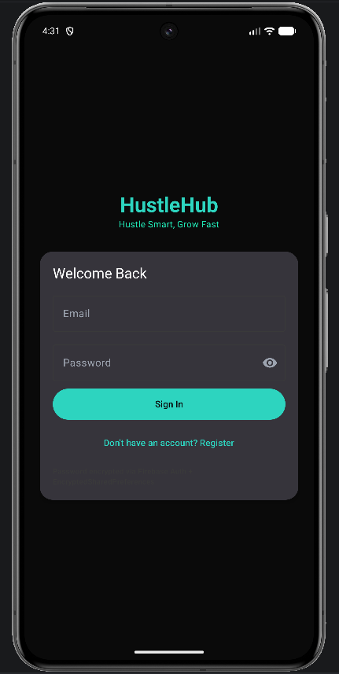
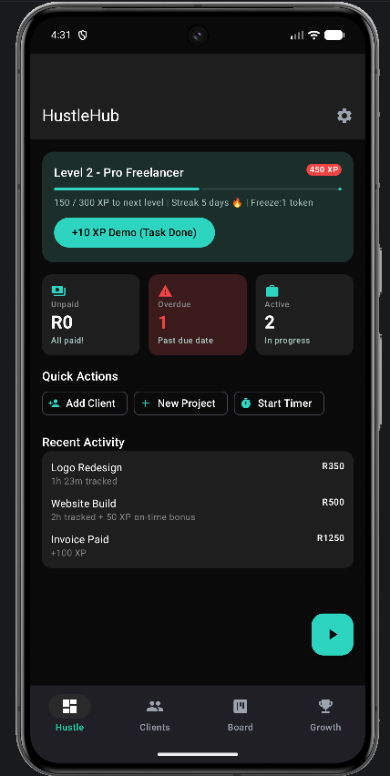
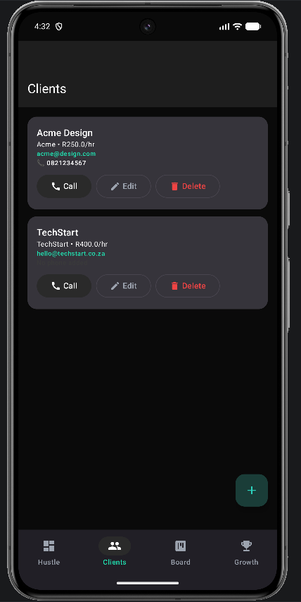
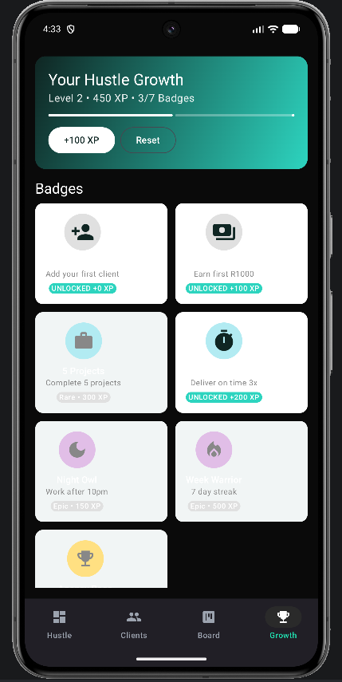
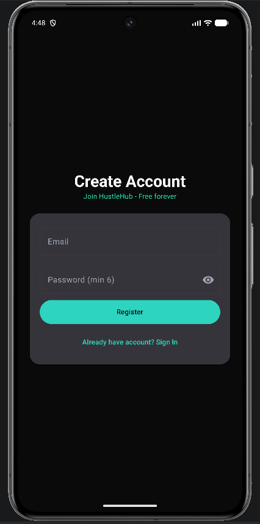
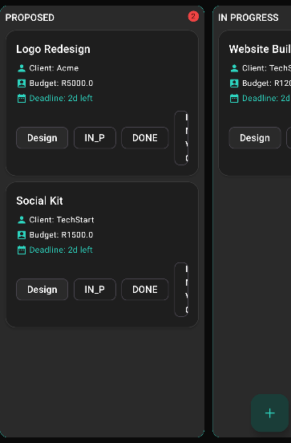
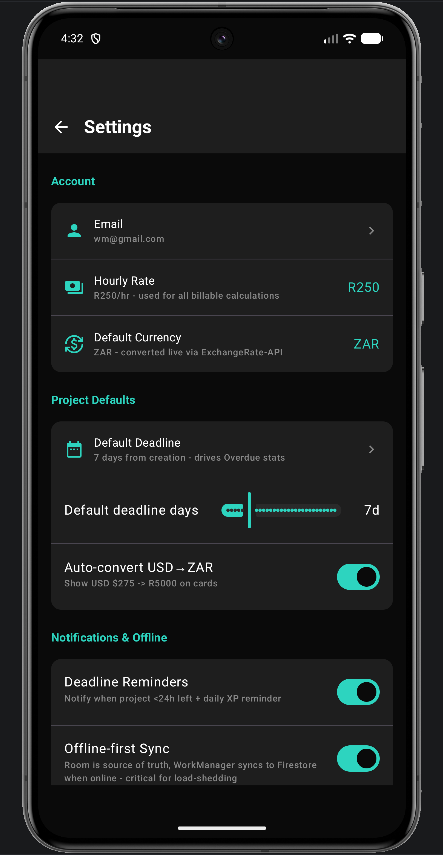

# 🚀 HustleHub - Freelance Business Manager
### *Hustle Smart, Grow Fast*

> **Professional Business Tool** | Platform: Android (Kotlin + Jetpack Compose)

[[Kotlin](https://img.shields.io/badge/Kotlin-2.0-purple?logo=kotlin)](https://kotlinlang.org/)
[[Jetpack Compose](https://img.shields.io/badge/Jetpack%20Compose-Material3-4285F4?logo=jetpackcompose)](https://developer.android.com/jetpack/compose)
[[Firebase](https://img.shields.io/badge/Firebase-Auth%20%2B%20Firestore-FFCA28?logo=firebase)](https://firebase.google.com/)
[[Room](https://img.shields.io/badge/Room-Offline--First-003B57?logo=android)](https://developer.android.com/training/data-storage/room)

HustleHub is an offline-first, ZAR-friendly freelance business manager. It combines client management, Kanban project tracking, billable time tracking, PDF invoicing, and gamification to keep you productive and motivated.

**Product Demo:** [▶️ Watch Demo on YouTube](https://youtu.be/MQVb-npr1_w)

---

## 📸 Screenshots

| Login & Register | Dashboard & Kanban | Clients & Settings | Growth & Badges |
| :---: | :---: | :---: | :---: |
|  |  |  |  |
|  |  |  | |

---

## ✨ Core Features

### 1. Secure Authentication
- **Modern Onboarding:** Dedicated Login & Register flows with Material 3 charcoal+teal design.
- **Enhanced Security:** Firebase Authentication with token-based local persistence via **EncryptedSharedPreferences**.
- **Data Protection:** Secure handling of user credentials and sensitive session data.

### 2. Client Management
- Full CRM capabilities: Add, edit, and manage client profiles with detailed contact info.
- **One-Tap Contact:** Integrated call functionality using Android Intents for immediate client outreach.
- **Trust Tracking:** Manage client relationships with built-in trust scoring and rate tracking.

### 3. Kanban Project Board
- **5-Stage Workflow:** Track progress from Proposal to Payment (PROPOSED, IN_PROGRESS, DONE, INVOICED, PAID).
- **Interactive Layout:** Long-press drag-and-drop support with quick-move status chips.
- **Smart Monitoring:** Real-time tracking of deadlines, budgets (with USD→ZAR conversion), and task progress.
- **Overdue Alerts:** Automated visual cues for projects nearing or past their deadlines.

### 4. Project Details & Task Tracking
- **Granular Control:** Manage full project descriptions and multi-step checklists (up to 10 tasks per project).
- **Persistence:** Local-first storage ensures task lists are accessible even without internet.
- **Gamified Progress:** Earn XP for completing tasks and meeting deadlines on time.

### 5. Dynamic Dashboard
- **Business Intelligence:** Live calculation of unpaid invoices, overdue projects, and active workloads.
- **Productivity Metrics:** Visual indicators for current levels, streaks, and upcoming tasks.
- **Actionable Insights:** Quick-access buttons for the most common freelance workflows.

### 6. Professional Invoicing & Timer
- **Time Tracking:** Integrated Foreground Service timer to record billable hours accurately.
- **PDF Generation:** One-click invoice creation pulling real-time data from project metrics.
- **Automated Billing:** Calculates totals based on custom hourly rates set in user preferences.

### 7. Gamification & Growth
- **Engagement Engine:** Level-up system based on business milestones and productivity.
- **Badge Achievement:** 7 unlockable badges with rarity tiers and animated unlock states.
- **Streak System:** Maintain daily activity streaks with "Freeze Token" protection.

### 8. Comprehensive Settings
- **User Customization:** Tailor your experience with dark theme toggles and notification preferences.
- **Business Logic:** Set default project deadlines, hourly rates, and preferred currencies.
- **Data Transparency:** Clear visibility into storage usage and secure data management options.

---

## 🛠 Tech Stack

| Layer | Technology |
| :--- | :--- |
| **UI** | Jetpack Compose (Material 3) |
| **Auth** | Firebase Auth + EncryptedSharedPreferences |
| **Local Data** | Room Persistence Library (Offline-First) |
| **Cloud Sync** | Google Firestore |
| **External APIs** | ExchangeRate-API (Financial) & ZenQuotes (Motivation) |
| **Operations** | WorkManager (Background Tasks) & Foreground Services |
| **Networking** | Retrofit + OkHttp |

---

## 🏗 Architecture

HustleHub follows **Clean Architecture** principles with an **MVVM** (Model-View-ViewModel) pattern, ensuring a scalable and testable codebase.

- **Offline-First:** Room acts as the single source of truth, with WorkManager handling asynchronous synchronization with Firestore.
- **Reactive UI:** Compose screens observe state changes via StateFlows, ensuring a fluid user experience.

---

## 📦 Installation & Setup

### Prerequisites
- Android Studio (Latest Version)
- JDK 17+
- A Firebase Project

### Steps
1. **Clone the repository:**
   ```bash
   git clone https://github.com/Wasama1904/hustlehub.git
   ```

2. **Configure Firebase:**
   - Add your `google-services.json` to the `app/` directory.
   - Enable Email/Password Auth and Firestore in the Firebase Console.

3. **Set API Keys:**
   Create a `local.properties` file in the root directory:
   ```properties
   EXCHANGE_RATE_API_KEY=your_key_here
   ```

4. **Build and Run:**
   Sync Gradle and deploy the `:app` module to your device or emulator.

---

## 🚧 Roadmap

- [ ] Material 3 DatePicker migration
- [ ] Actionable timer notifications
- [ ] Financial growth charting
- [ ] CSV/Excel data export

---

## 👤 Author

**Wasama Makolo - ST10451742**
IT and Software Developer
Cape Town, South Africa 🇿🇦
